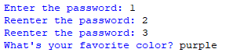

## Description
This program prompts the user to enter a password, with up to three attempts to get it right. In case of repeated incorrect attempts, the program asks a personal question, such as the user's favorite color. Upon successful authentication, the program warmly greets the user with a "Hello".
## Example
♡ Example 1  
  
♡ Example 2  
  
♡ Example 3  
  
♡ Example 4  

